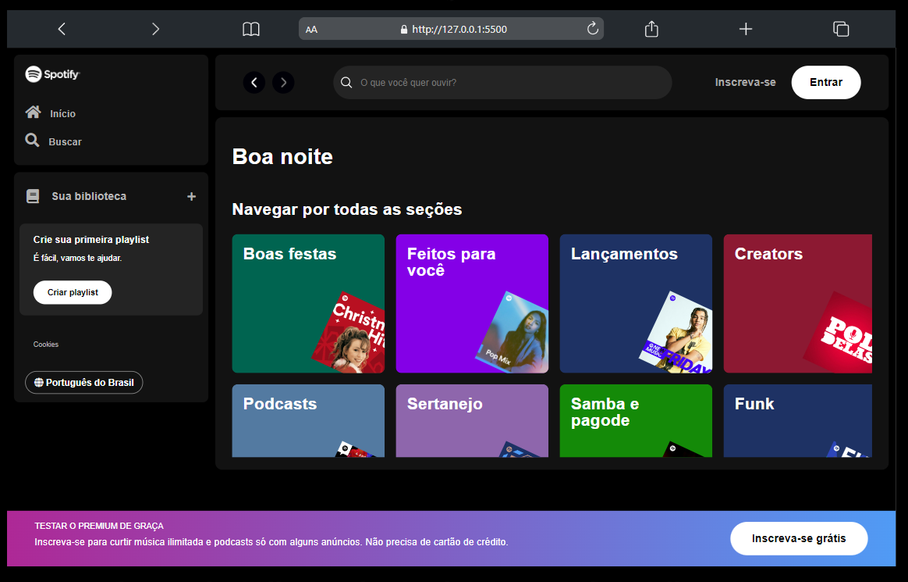
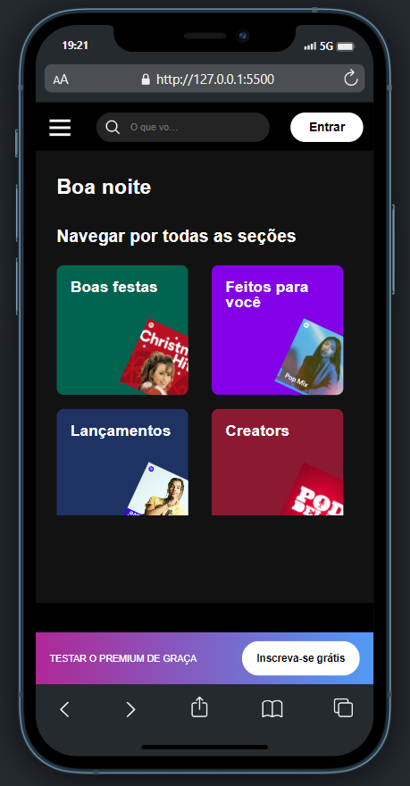
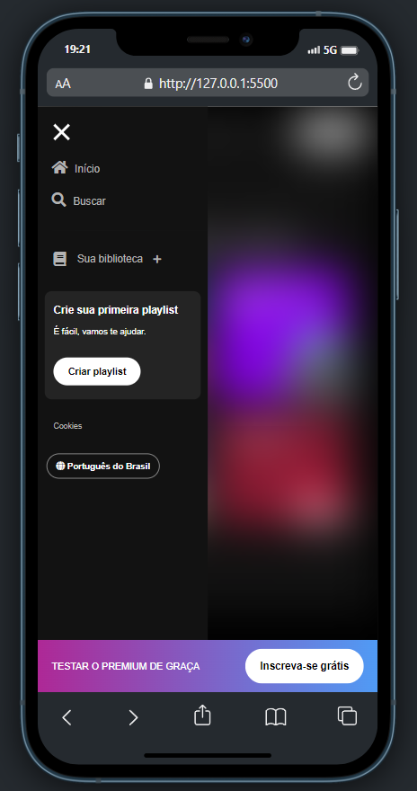

# Clone Spotify 🎧

Clone da página inicial do Spotify com algumas alterações, desenvolvido durante a Imersão Front-End Alura 2024.

🌐 ACESSE O PROJETO HOSPEDADO [CLICANDO AQUI](https://gabrielbuttendorf.github.io/imersoes/clone-spotify-alura/)

## Imagens do Projeto

    
     
    
    

### Tecnologia Utilizadas

    
    
    

### Redes Sociais 👨🏻‍💼

- [Linkedin](https://www.linkedin.com/in/gabrielbuttendorf/)
- [Instagram](https://www.instagram.com/bieel.felipe_/)
- [GitHub](https://github.com/gabrielbuttendorf)
